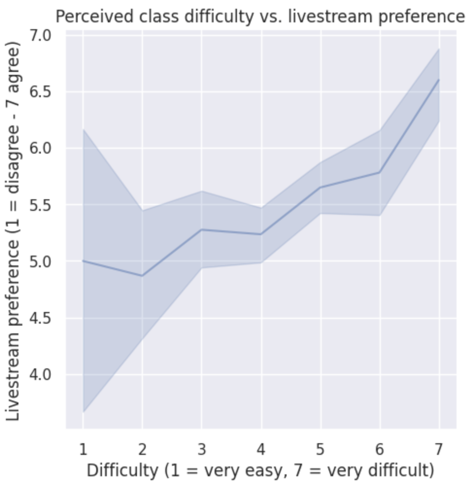
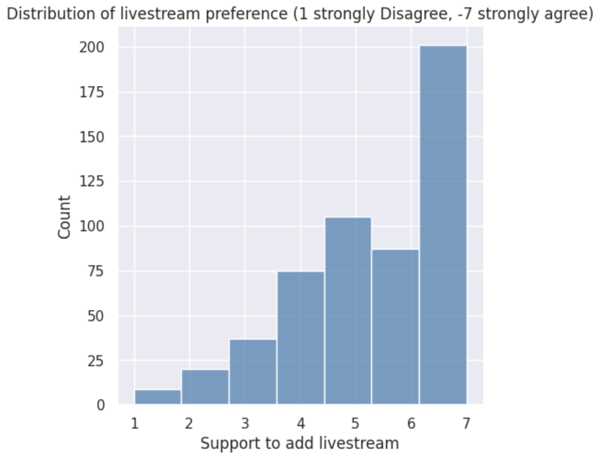
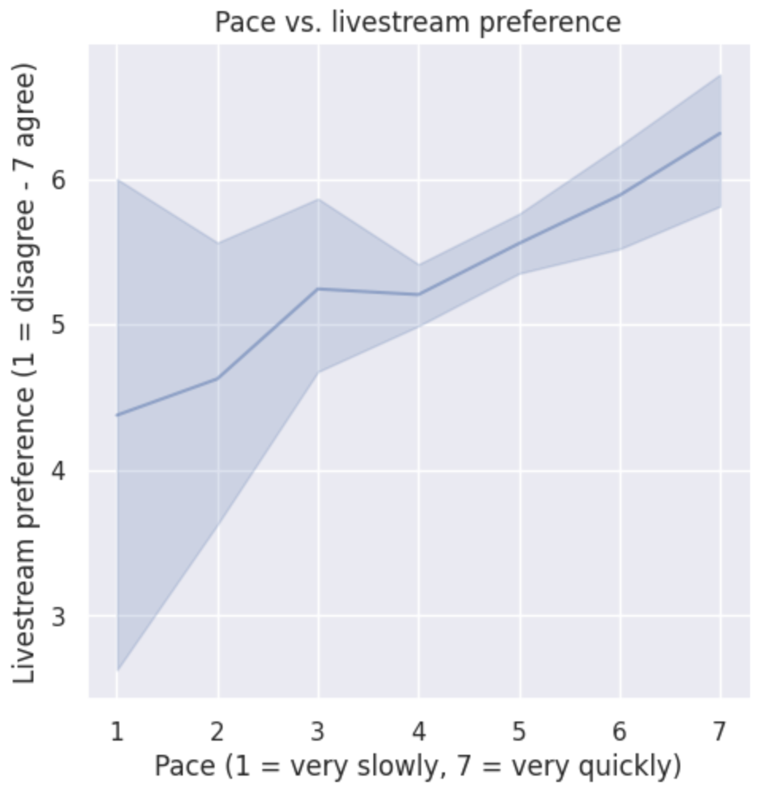

# Do not edit the text between these lines!
layout: default
---

# EX09 Website

<!-- This is a comment. Below, you'll see code for inserting an image. To make this image appear, update <custom-path>. To add an image, save it inside the imgs folder of this repository. -->
<!-- EXAMPLE -->

## Difficulty and Livestream Preference Relationship
 

 
Description
 

## Livestream Count

 
Description
 

## Class Pace and Livestream Preference Relationship

 
Description
 

## (smaller header for each graph) This is basic paragraph text for summary of the analysis and conclusion.

summary of the analysis
conclusion from previous
